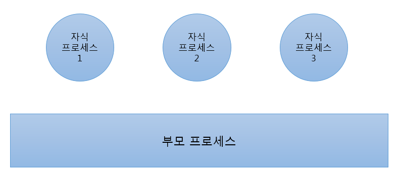

# 이제부터 마이크로 서비스 운영

## 10. 장애처리

#### 10.1 Failover와 Fault Tolerant

 서비스 중인 프로세스에 문제가 발생하는 원인은 매우 다양하다. 내부적으로는 <strong> 감당하기 힘든 부하, 코드 문제, 운영체제 문제, 다른 프로세스의 간섭 </strong>으로 중단 될 수 있고, 외부적으론 <strong>하드웨어적인 결함이나 네트워크 문제, 사람의 실수 </strong> 등 많은 이유로 프로세스가 종료되기도 한다. 이를 대응하는 방법으로 Failover와 Fault Tolerant란 개념이 있다.

 __Failover__ 는 시스템에 문제가 발생 했을 때 준비해둔 <strong>예비 시스템</strong>으로 자동 전환해서 서비스가 중단되지 않도록 하는 기능이다. __Fault Tolerant__ 는 시스템에 문제가 발생하면 전체 시스템을 다운하는 것이 아니라 문제가 발생하지 않은 부분은 정상적으로 수행하는 기능이다.

 마이크로서비스 아키텍처는 기본적으로 분산 아키텍처이기 때문에 Failover와 Fault Tolerant 기능을 수행하고 있다. 하지만 스스로 프로세스를 복구하는 기능이 없다면 고가용성 시스템이라고 하기 어렵다.

 #### 10.2 cluster 모듈 활용

Node.js에는 cluster라는 모듈을 기본으로 제공한다. 이 모듈은 __우리가 실행한 프로세스에서 원하는 만큼 자식 프로세스를 생성__ 한다. 문제가 발생해도 자식 프로세스 하나에서만 발생하기 때문에 다른 자식 프로세스는 정상적으로 서비스할 수 있다. 게다가 종료된 자식 프로세스를 감지해 또 다른 자식 프로세스도 실행 가능하다. ~~개쩐다...~~

자식 프로세스 1에 문제가 발생해도 나머지 자식 프로세스는 정상서비스 된다. 자식 프로세스 1이 종료되면 이를 감지해서 자식프로세스 3(왜 하필 3?)을 실행

> cluster 모듈 예시는 nodejs 디렉토리에 따로 정리, 7장 microservice들 클러스터 모듈 적용

