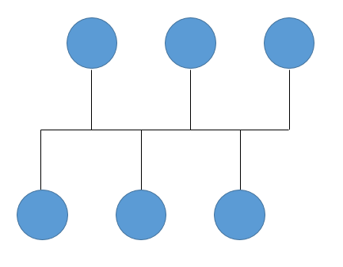
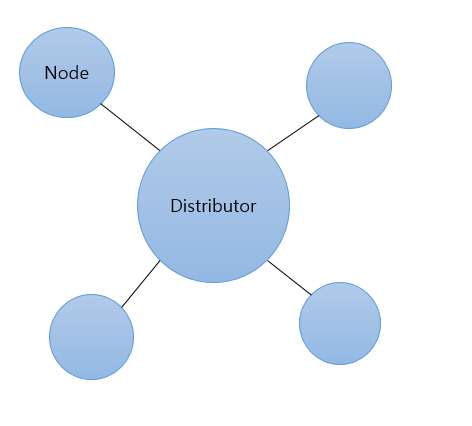

## 6. 모놀리식에서 마이크로 서비스로(분산 아키텍처)

### 6.1 마이크로서비스와 분산 아키텍처

5번 디렉토리에서 모놀리식에서 기본적인 기능을 가진 상품 판매 http 서버를 만들어 봤다. 하지만 시간이 흐를수록 요구사항은 늘어가고 기능 또한 복잡해질 것이다.

기업에서는 빠른 개발보다는 안정적인 개발을 추구할 것인데 이러면 서비스 업데이트 주기가 느려질 것이다. 실제로 적은 인원의 스타트업 기업보다 풍부한 인력을 보유한 대기업의 업데이트 주기가 느린 경향의 이유가 여기 있다.

이 문제의 근본적인 원인은 모놀리식 아키텍처의 한계점이다. 마이크로 아키텍처가 어떻게 이 문제를 해결할 수 있는지 알아볼 것이다.

### 6.2 토폴로지의 이해

분산 아키텍처를 구성하려면 시스템간 네트워크를 어떻게 연결하여야 되는지 고민해야하기에 토폴로지부터 이해해야 한다.

#### 6.2.1 버스형

버스만 안정적이라면 노드간 간섭이 없어 안정적이고, 노드 추가, 삭제가 매우 쉽다. 하지만 버스에 부하가 발생하면 전체 성능이 저하되는 단점이 있다.

#### 6.2.2 트리형
여러 버스 토폴로지가 결합한 구조

#### 6.2.3 링형
부하가 집중되는 노드가 없어 병목이 발생하지 않으나 한 노드의 장애가 전체 장애로 이어질 수 있다.

#### 6.2.4 성형
중앙 집중식을 노드 확장이 쉽다. 그러나 노드 갯수가 많아질 수록 효율이 떨어진다는 단점이 있다.

#### 6.2.5 망형
그물 모양으로 각 노드를 1:1로 연결하는 구조이다. 장애에 가장 안전한 구조이지만 구현이 어렵다. 

### 6.3 분산 시스템 만들기

__망형 토폴로지__ 를 소프트웨어적으로 구현하려면 __노드들의 위치와 접속 가능 상태__ 를 알아야 한다.

가장 간단한 방법은 모든 노드가 접속할 수 있는 서버에 자신의 정보를 저장하고, 저장된 정보를 조회하면 분산 환경에서 원하는 노드에 접속할 수 있다.

모든 노드가 접속해 자신의 상태를 저장할 수 있는 서버를 Distributor로 설정한다. 서비스 중 Distributor 가 문제가 발생해도 안정적으로 동작하려면 다음 __세가지__ 상태를 고려해야한다.

1. Distributor가 실행되지 않았을 때도 노드들은 Distributor에 주기적으로 접속을 시도해야한다.

2. 노드가 Distributor에 접속하거나 접속이 종료되었을 때 Distributor도 이를 인지하고, 다른 노드에 이 사실을 전파해야 한다.

3. Distributor가 종료되어도 각 노드는 알고 있는 정보를 이용해 노드 간 접속 상태를 유지해야 한다. (1) 상태로 돌아가 Distributor에 다시 접속될 때까지 주기적으로 접속을 시도해야 한다.

Distributor는 HTTP서버와 TCP 서버 중 어떤 타입으로 만드는 것이 좋을까? 노드들의 접속 상태를 알려면 접속 종료 이벤트를 인지할 수 있는 __TCP 서버__ 로 만드는 것이 유리하다. 

Distributor 입장에서 각 노드는 클라이언트이지만 요청을 처리하는 서버이기도 하다. 그래서 Distributor와 노드들을 공통으로 사용할 Client와 Server 클래스를 상속받아 구현한다.

#### 6.3.1 Client 클래스 만들기

Client 클래스는 클라이언트의 기본 기능인 __접속__, __데이터 수신__, __데이터 발송__ 세가지 기능으로 구성한다. 자식클래스에서는 접속과 데이터 발송만 접근하고 데이터 수신은 수신을 완료하면 생성자에서 전달한 함수로 콜백 호출되도록 합니다.

#### 6.3.2 Server 클래스 만들기

서버의 기본 기능인 __리슨__, __데이터 수신__, __클라이언트 접속 관리__ 외에 앞에서 만든 클라이언트 클래스를 이용해 Distributor에 주기적으로 접속을 시도하는 기능을 만든다.

#### 6.3.3 프로토콜 정의

>Distributor API

|기능|메서드|URI|
|---|----|----|
|노드 등록|POST|/distributor|
|노드 조회|GET|/distributor|

>노드 등록 입력 파라미터

|파라미터명|의미|타입|
|---|---|----|
|port|리슨 포트 정보|Number|
|name|노드명|String|
|urls|담당 처리 url 목록|Array[String]|

>노드 조회 결과 파라미터

|파라미터명|의미|타입|
|----|---|---|
|port|리슨 포트 정보|Number|
|name|노드명|String|
|urls|담당 처리 url 목록|Array[String]|
|host|접속 정보|String|

#### 6.3.4 Distributor 만들기
