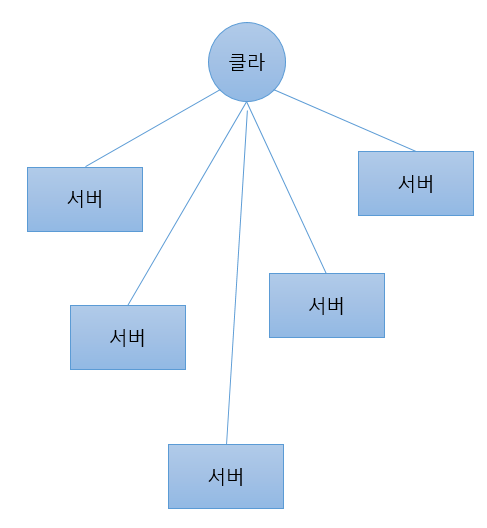
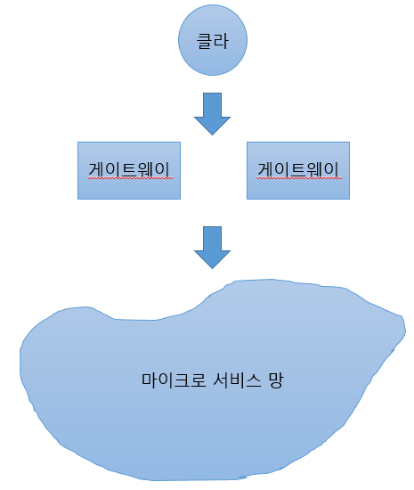
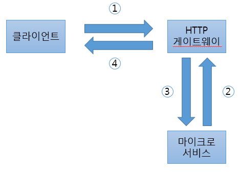

## 8. 인터페이스 통일

### 8.1 인터페이스

 클라-서버 관점에서 보면 마이크로서비스 아키텍처는 많은 서버가 API를 각각 제공하는 구조이다. 따라서 클라이언트는 모든 서버의 접속 정보와 패킷 구조를 알아야한다. 모든 API에서 일일이 코드를 작성해야 할 것이다. 

 

이러한 문제를 해결하려면 통일된 패킷 구조와 인터페이스 하나로 모든 API를 호출할 수 있는 구조를 만들어야한다.

### 8.2 레이어의 필요성

클라이언트가 인터페이스 하나로 모든 마이크로 서비스를 호출하려면 레이어 개념이 필요하다.

게이트웨이와 마이크로서비스를 분리된 레이어로 설계한다. 클라이언트는 게이트웨이로 접속한다. 이때 게이트웨이는 HTTP, TCP, PROTOBUF 등 다양한 형태의 서버가 될 수 있다. 게이트웨이는 여러개가 될 수 있는데 게이트웨이 간 통신은 하지 않는다.

게이트웨이는 망형 구조로 연결된 마이크로서비스들과 연결된다. 앞에서 만든 Distributor를 이용해 모든 마이크로서비스와 접속하거나 필요한 마이크로서비스와 제한적으로 접속할 수도 있다. 또 보안을 위해 IP를 제한할 수 있고 API를 필터링 할 수 있다.

### 8.3 HTTP 게이트웨이 만들기

HTTP 게이트웨이는 기본적으로 HTTP 서버다. HTTP에 대한 요청을 받아 메모리에 저장한 후 해당 API에 대한 마이크로서비스를 호출한다. 마이크로서비스는 응답이 오면 조금 전 메모리에 저장한 HTTP 요청 객체를 찾아 응답하고는 메모리에서 지운다.

1. HTTP 요청
2. 요청 객체 저장 후 마이크로서비스 호출
3. 응답
4. 응답 후 요청 객체 삭제

