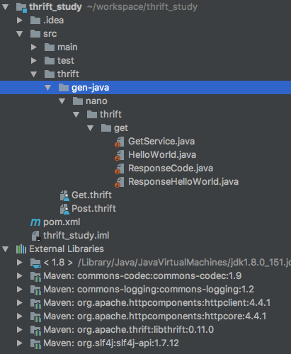
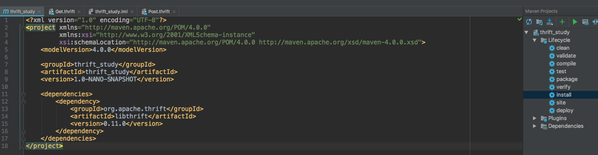

Thrift 공부
============

Thrift라는 통신 방법을 사용하여 다른 서버와 통신하는 서버를 다루게 됐다.
보통 웹서버를 다루면 HTTP통신 + JSON/XML 이 정통적인 방식인데, 생소했다.

개발 당시 Thrift 통신을 채택한데에는 몇가지 이유가 있다.
<pre>
1. Http는 직렬화, 역직렬화가 필요하고 JSON, XML을 사용하기 위해선 파싱 작업이 필요해서 비용이 크다.
2. Thrift는 바이너리 데이터 전송도 가능해서 메모리가 적게 들고, 더 빠르다.
3. 다양한 언어를 지원한다. 
4. IDL(api 규약이라고 생각해도 됨)만 작성해두면 여러 언어의 소스코드를 생성해낼 수 있어 편리하다.
</pre>

이러한 여러 이유로 Thrift 통신을 사용하게 되었다고 한다.
그럼 본격적으로 Thrift 통신에 대해서 알아보자

## Thrift?
<pre>
RPC(Remote Procedure Call) 방식을 대표하는 통신 프레임워크로, 아파치 재단이 서비스하고 있다. 효율적인 코드 생성 엔진을 사용하여, IDL로 작성한 통신 인터페이스 코드를 여러가지 언어의 소스코드로 변환해준다.  C++, python, java, PHP, Ruby, C# 등등 다양한 언어를 지원한다. 
</pre>

## RPC?
<pre>
 Remote Procedure Call의 약자로,  원격 API를 호출하는 방법이다.
 REST 방식은 URI를 자원으로 표현하고 이를 요청하여 원격 서버의 리소스에 대한 상태를 주고받는 방식이다. 
 반면에, RPC 는 IDL(Interface Definition Language) 를 통해 원격 서버의 메소드 스펙을 알 수 있고,
 이 메소드를 호출하여 네트워크 통신 과정을 추상화 한 것이라고 볼 수 있다.
 결과적으로 프로그래머는 네트워크 통신 작업을 신경쓰지 않고 비즈니스 로직 개발에 더 집중할 수 있다.
</pre>

## Thrift Work Flow
<pre>
1. IDL로 통신 인터페이스를 작성한다 (작성 방법은 곧 살펴보자)
2. 작성한 인터페이스 코드를 RPC 프레임워크에서 제공하는 툴을 이용해서, 각 언어에서 사용할 소스코드 생성
3. 생성된 소스코드를 이용하여 클라이언트/서버 개발
</pre>

## 통신 인터페이스 작성
간단한 통신 인터페이스를 작성해보자.
Get.thrift 라는 파일을 작성해보았다.
<pre>
namespace java nano.thrift.get

struct HelloWorld {
    1: optional string msg,
    2: optional string name,
    3: optional i32 age
}

enum ResponseCode {
    SUCCESS = 200,
    ERROR = 500,
    NOT_FOUND = 404,
    INVALID_REQUEST = 400
}

struct ResponseHelloWorld {
    1: required ResponseCode responseCode,
    2: optional String msg
}

service GetService {
    ResponseHelloWorld helloworld(1:HelloWorld helloworld)
}
</pre>

struct, enum은 요청으로 넘어올 데이터를 매핑할 자료형이다. 
optional은 없어도 되는 값이지만, required는 반드시 필요한 데이터이다. 따라서 값이 채워져있어야 한다.

namespace 선언을 통해 사용할 언어, 생성될 소스코드의 패키지명을 정의할 수 있다.

## Complie
컴파일을 하기 위해선 thrift 명령어가 필요하다. 
구글에 검색하면 설치방법이 많이 나오니 생략하겠다.
현재 나의 thrift --version의 결과는 0.10.0이다. (현재 최신 버전은 0.11.0 로 알고있다)

이제 .thrift 파일이 있는 곳으로 경로를 이동하여 아래 명령을 수행하여 컴파일 해보자.

<pre>
thrift --gen java Get.thrift
>thrift 명령어로 Get.thrift 인터페이스를 컴파일해서 java 소스코드를 generate 해라 라는 뜻

thrift --gen java -o ../thrift/ Get.thrift
>Output Directory를 -o 옵션으로 지정

</pre>

통신 인터페이스는 짧은데 생각보다 긴 자바 소스코드가 튀어나왔다.

이렇게 gen-java 디렉토리 하위에 자바 소스 코드들이 생겼고 GetService의 iface라는 내부 인터페이스가 존재하는데, 이 인터페이스에 통신 인터페이스의 메소드들이 정의되어 있다.

서버 개발자는 이 내용을 jar로 뽑아내서 가져가 구현하면 된다.
maven에서 install을 진행하면 jar 파일이 생성되는 것을 확인할 수 있다.

maven 설정을 변경한 적이 없다면 디폴트로  .m2/repository 라는 로컬 디렉토리에 jar 파일이 생성된다.
한번 확인해보기!
