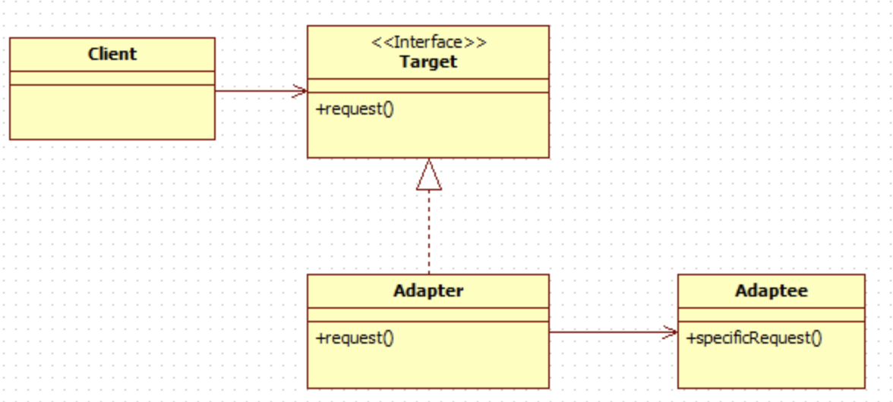
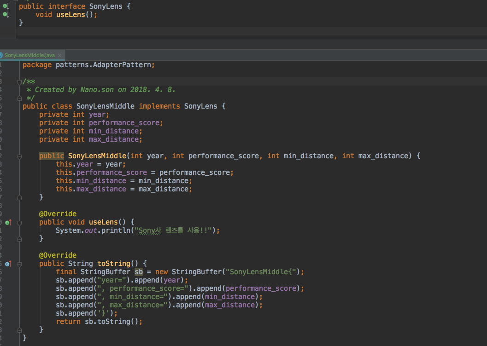
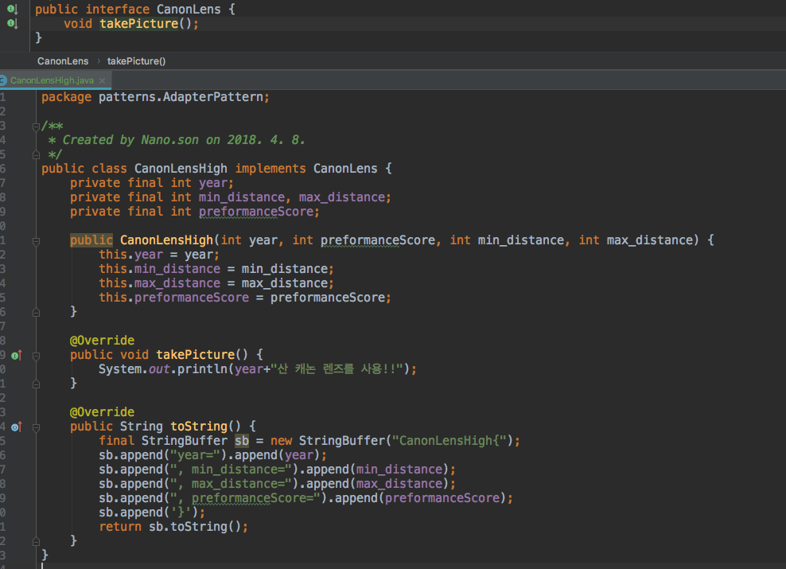
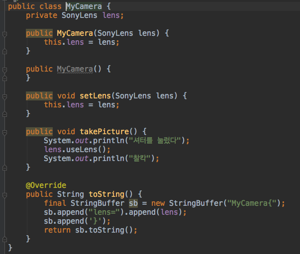
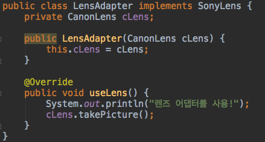
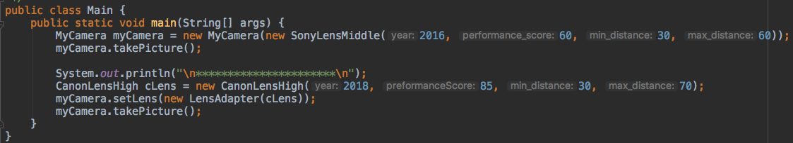
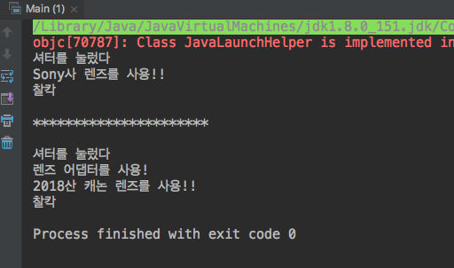

Adapter Pattern
=========================
## 어댑터 패턴이란?
<pre>
자료형A의 객체를 마치 자료형B의 객체 처럼 사용하도록 해주는 패턴이다.
</pre>

이해를 돕기 위해 콘센트 예시를 살펴보자
<pre>
우리나라는 일명 돼지코 콘센트를 사용하는데, 110v를 사용하는 외국에서는 우리나라의 전기 콘센트와 맞물리지 않는다.
이 때 사용하는 것이 변환 어댑터이다. 이 것만 있으면 기존 콘센트를 새로 살 필요 없이 계속 쓸 수 있다.
또한 220v 콘센트를 110v 콘센트인것 처럼 사용할 수 있다.
</pre>

###### 다시 말해 어댑터는 서로 맞물리지 않는 두 코드를 수정하지 않으면서 호환되게 만들어주는 패턴이라고 할 수 있다.

어댑터 패턴에는 두가지가 있다.
	1. 객체 어댑터
	2. 클래스 어댑터

다만 클래스 어댑터는 다중 상속이 가능해야하는데, 자바는 다중 상속을 지원하지 않는다.
따라서 이 글에서는 객체 어댑터에 대해서만 다룬다.
( 클래스 어댑터 설명 참조 : http://jusungpark.tistory.com/22 )

어탭터 패턴의 클래스 구성도는 다음과 같다.
(출처 : http://jusungpark.tistory.com/22 )

여기서 클라이언트는 Adaptee 타입의 객체들을 Target 타입으로 다룰 수 있는데, Target과 Adaptee 사이에 Adapter가 존재함으로써 가능하다.

## 구현 예시
 구현을 해야하다보니 조금 억지스러운 코드라는 느낌이 들지만... 양해 부탁 ㅠㅜㅠㅜ
<pre>
카메라를 예시로 들어보자. 카메라에서 렌즈의 종류는 아주 많다.
그리고 특정 카메라에서는 끼울 수 없는 렌즈도 존재한다.
어댑터를 통해서 끼울 수 없는 렌즈를 장착가능하도록 코드를 작성해보자.

나의 카메라는 소니의 카메라로, 소니의 렌즈들만 장착할 수 있다고 가정하자.
그런데 아주 맘에 드는 스펙의 렌즈를 캐논에서 출시했다.
하지만 캐논의 렌즈는 나의 카메라와 맞물리지 않는다.
</pre>

코드 구성은 아래와 같다. (실제 코드는 따로 파일을 올릴거임)

##### 소니 렌즈

##### 캐논 렌즈

##### 카메라

##### 어댑터

##### 실행

##### 실행 결과

조금 억지스러운 예시이긴 하지만.. 개념에만 집중해보자
나의 카메라는 소니 렌즈만 장착 가능하도록 필드(프로퍼티)가 설정되어 있다.

하지만 어댑터 클래스를 사용하여 캐논 렌즈를 담고(필드로 가짐), 형태를 소니 렌즈로 하여(implements SonyLens)
캐논 렌즈를 소니 렌즈 처럼 사용할 수 있게 되었다!

여기서 주목할 것은 어댑터 패턴 사용을 통해 기존 코드 (렌즈들, 카메라)를 전혀 수정하지 않았다는 것이다.
이렇게 어댑터 패턴은 코드의 호환성을 높여주는 효과를 준다.

