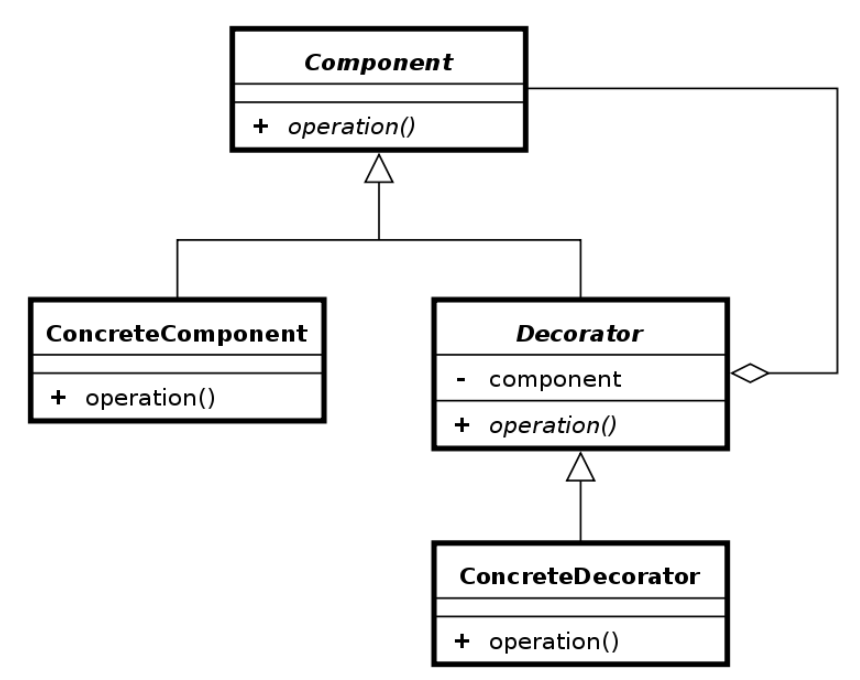
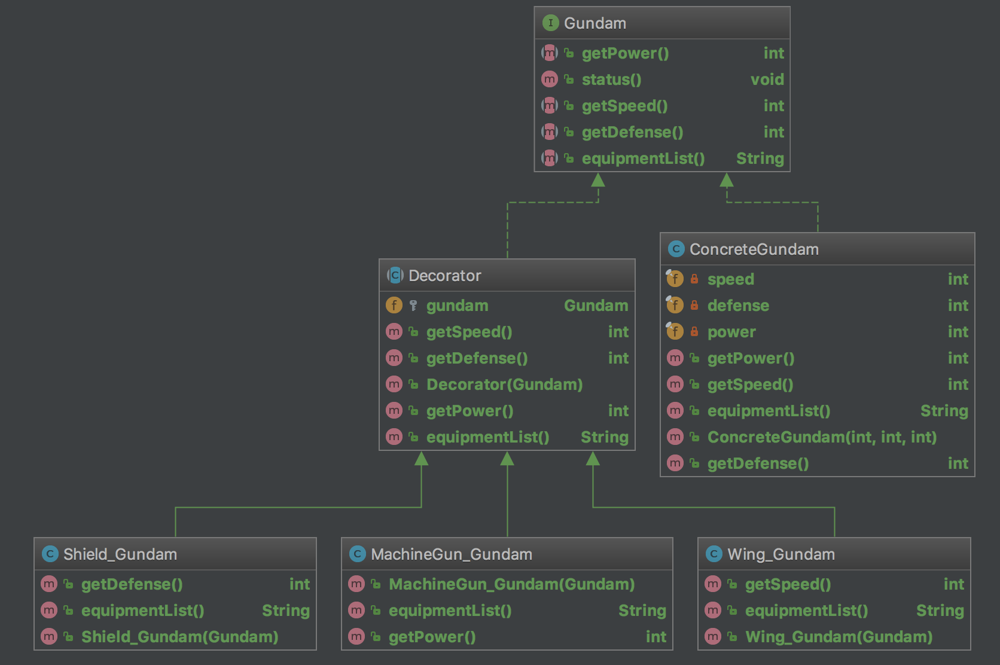

Decorator Pattern
================================
참고
> http://jusungpark.tistory.com/9
> http://friday.fun25.co.kr/blog/?p=189

## 데코레이터 패턴이란?
```
위키 검색 결과:
In object-oriented programming, the decorator pattern is a design pattern that allows behavior to be added to an individual object, either statically or dynamically, without affecting the behavior of other objects from the same class.[1] The decorator pattern is often useful for adhering to the Single Responsibility Principle, as it allows functionality to be divided between classes with unique areas of concern.[2] The decorator pattern is structurally nearly identical to the chain of responsibility pattern, the difference being that in a chain of responsibility, exactly one of the classes handles the request, while for the decorator, all classes handle the request.
```

#### 즉, 코드 수정 없이 클래스를 확장할 수 있다라는 개념인데, 아직 감이 잘 잡히질 않는다.

OOP 원칙 중 Open-Closed Principle을 잘 만족하는 예라고 할 수 있다.
> OCP : 확장에는 열려있고 변경에는 닫혀있어야 한다.

어떤 상황에서 데코레이터 패턴이 유용할까?

참고 url에 마음에 드는 사례가 있어서 응용해보겠다.

나는 건담으로 ㅋ

#예시 상황

건담 만화에는 다양한 건담 로봇들이 등장한다.
아주 기본적인 건담 로봇에 기관총을 달고, 날개를 달고, 방어구를 입히고.. 복잡할 정도로 종류가 많다.

이걸 클래스로 옮겨야 한다면? 종류가 추가 될 때 마다 클래스를 추가해야할까?

끔찍한 경우가 될거다. 건담 로봇 종류만 해도 최소한 수십개가 될 테니까

데코레이터 패턴을 모를 때 라면 이렇게 코드를 짰을 것이다.

```
public abstract class Gundam {
    protected int power=10;

    public int getPower() {
        return this.power;
    }

    public void showStatus() {
        System.out.println("base Gundam");
    }
}

class MachineGun_Gundam extends Gundam {
    ...
}

class MachineGun_Sword_Gundam extends Gundam {
    ...
}

//머신건과, 날개와, 검과, 방패를 장착한 건담
class MachineGun_Wing_Sword_Shield_Gundam extends Gundam {
    ...
}
```
만약 여기서 머신건, 날개, 검, 방패를 장착한 건담에 팔을 두개 더 달고, 머신건을 두개 더 달고, 등 별짓을 다해놓은 건담이 나온다면??
클래스 이름부터 난장판일거다.

이제 본능적으로 확장에 취약한 상황이란 것을 알아차렸을 것이다.

그러면 데코레이터 패턴을 사용하려면 어떻게 해야할까?

우선 데코레이터 패턴의 기본적인 클래스 다이어그램은 아래와 같다.


상속하는 대신 구성(composition)하는 기법을 사용했다.
상속을 통해 일련의 규약을 형성하고, 구성을 통해 확장성을 확보했다.

그럼 데코레이터 패턴을 사용한 코드들을 살펴보자



모든 건담의 베이스가 될 건담이 ConcreteGundam이다.
이 건담에 덕지덕지 장비들을 덧붙여 주는 역할로, MachineGun_Gundam, Sheild_Gundam, Wing_Gundam 데코레이터들이 존재한다.
데코레이터들의 규약을 정하기 위해 Decorator라는 추상 클래스를 두었다.

```
public interface Gundam {

    int getPower();

    int getDefense() ;

    int getSpeed();

    String equipmentList();

    default void status() {
        System.out.println("--------------------------");
        System.out.println("equipment List:"+this.equipmentList());
        System.out.println("power:"+this.getPower());
        System.out.println("defense:"+this.getDefense());
        System.out.println("speed:"+this.getSpeed());
    }
}
```

#### 베이스 건담
```
public class ConcreteGundam implements Gundam {
    private final int power;
    private final int defense;
    private final int speed;

    public ConcreteGundam(int power, int defense, int speed) {
        this.power = power;
        this.defense = defense;
        this.speed = speed;
    }

    @Override
    public int getPower() {
        return this.power;
    }

    @Override
    public int getDefense() {
        return this.defense;
    }

    @Override
    public int getSpeed() {
        return this.speed;
    }

    @Override
    public String equipmentList() {
        return "base";
    }
}
```

#### 데코레이터들
```
public abstract class Decorator implements Gundam {
    protected Gundam gundam;

    public Decorator(Gundam gundam) {
        this.gundam = gundam;
    }

    @Override
    public int getPower() {
        return gundam.getPower();
    }

    @Override
    public int getDefense() {
        return gundam.getDefense();
    }

    @Override
    public int getSpeed() {
        return gundam.getSpeed();
    }

    @Override
    public String equipmentList() {
        return gundam.equipmentList();
    }
}

public class MachineGun_Gundam extends Decorator {
    public MachineGun_Gundam(Gundam gundam) {
        super(gundam);
    }

    @Override
    public int getPower() {
        return gundam.getPower() + 10;
    }

    @Override
    public String equipmentList() {
        return "MachineGun / " +gundam.equipmentList();
    }
}

public class Shield_Gundam extends Decorator {
    public Shield_Gundam(Gundam gundam) {
        super(gundam);
    }

    @Override
    public int getDefense() {
        return gundam.getDefense() + 10;
    }

    @Override
    public String equipmentList() {
        return "Shield /"+gundam.equipmentList();
    }
}

public class Wing_Gundam extends Decorator {
    public Wing_Gundam(Gundam gundam) {
        super(gundam);
    }

    @Override
    public int getSpeed() {
        return gundam.getSpeed()+10;
    }

    @Override
    public String equipmentList() {
        return "Wing /" + gundam.equipmentList();
    }
}

```

이렇게 작성해두면 건담에 여러 장비를 손쉽게 추가할 수 있다.
장비를 아무리 추가해도 기존 코드를 수정하지 않아도 되기에, 확장에는 열려있고, 변경에는 닫혀있는 구조가 된다.

만약 레이저총 이라는 장비가 도입되면 데코레이터만 하나 추가로 만들어주면 된다.

코드는 따로 첨부해둔다.

> 기존 사람들의 코드를 보다가 건담은 인터페이스면 좋을 것 같고... protected보다는 최대한 private를 사용하도록 고쳤는데 이게 맞는지는 잘 모르겠다.
나름 객체 지향을 따진다고는 따졌는데 정말 객체지향적인지는 다시 한번 고려해봐야겠다.

