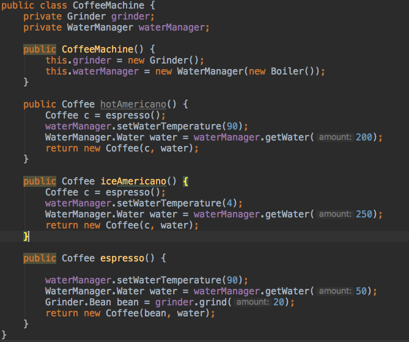

Facade Pattern
============================

## Facade
<pre>
1.(건물의)정면 2. 표면, 허울 (어학사전)
</pre>

퍼사드 패턴은 특정 시스템(혹은 서브 시스템, 모듈)의 인터페이스들에 대한 통한 인터페이스를 제공한다.
이러한 인터페이스를 고수준 인터페이스라 하고, 이걸 통해 해당 시스템을 편리하게 사용할 수 있다.

## 예시
커피 머신은 많은 부품과 기능들이 들어가있다.
원두를 어떤 크기로 갈지, 커피는 어떻게 내리길 바라는지, 온도는 얼마를 원하는지.. 커피 한 잔 내릴 때 마다 이런 설정을 해주기란 번거롭다.
우리는 그냥 " 아이스 아메리카노 하나!" 라고만 생각할 뿐인데.

그래서 각종 부품을 모아서 고수준 인터페이스를 제공하는 클래스를 만들 수 있다.

## 설명 (소스 코드는 source 디렉터리에 올릴 예정)
커피 머신은 다양한 기능을 하는 모듈로 구성이 된다.
예제를 간단하게 하기 위해 커피머신에는 그라인더와 물 조절장치만 존재한다.
다양한 커피를 내리기 위해 그라인더로 원두 크기를 조절하고, 물의 온도와 양을 조절해서 커피를 만들어 낸다.

따라서 Grinder, WaterManager 클래스가 필요하다.
또한 Grinder가 생산(?)해내는 갈린 원두인 Bean 클래스가 필요하다. Bean은 그라인더를 거쳐서 생성할 수 있으므로, Grinder 객체에서 팩터리 메소드로 Bean객체를 제공한다.

마찬가지로 WaterManager에서 물의 양, 온도를 조절해서 Water객체를 생산해낸다. 역시 팩토리 메소드로 Water객체를 생성해서 반환한다.

이러한 잡다한 과정을 거쳐서 에스프레소를 뽑아내야하고, 아메리카노를 먹기 위해서는 추가적으로 물을 부어야한다.

이래저래 잡다한 설명이 길었다. 
#### 아무튼 읽어보면 느끼듯이 간략화 했지만서도 커피 하나 만들기 참 복잡하고 까다롭다.

이걸 CoffeeMachine 클래스로 잘 감싸서 고차원의 인터페이스를 제공한다면 사용자는 "아이스 아메리카노 만들어줘" 와 같은 단순한 명령으로
이 복잡한 과정을 대신할 수 있다. (복잡한 과정을 클라이언트에게 숨김으로, 클라이언트는 편하게 사용할 수 있다)

억지스러운 상황을 재현한 코드라서, 코드도 좀 횡설수설 한 느낌이 들겠지만.. CoffeeMachine이라는 고차원 인터페이스 클래스를 통해서 커피 만드는 과정을 간략화 했다는 것만 기억하고 코드를 보자.

