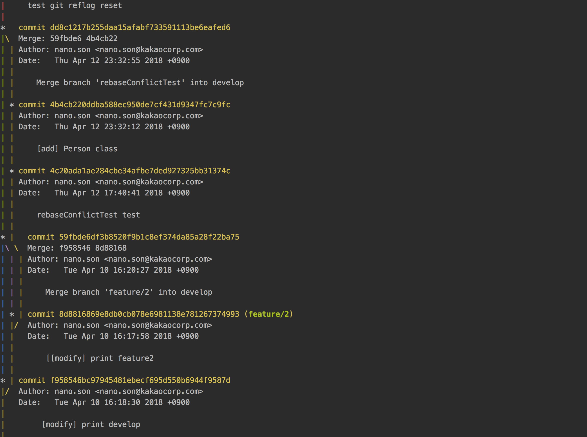
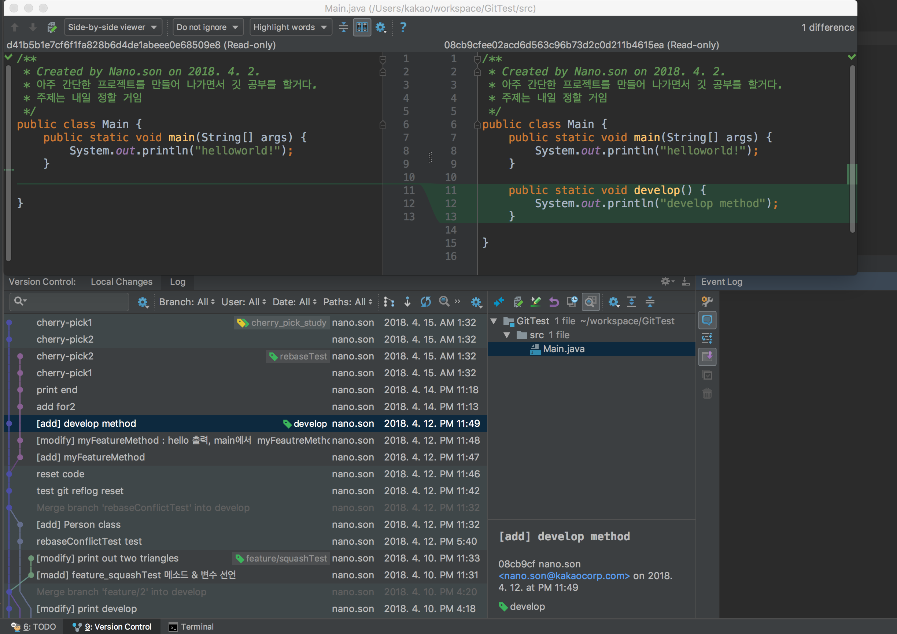
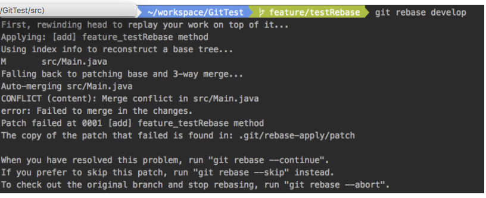
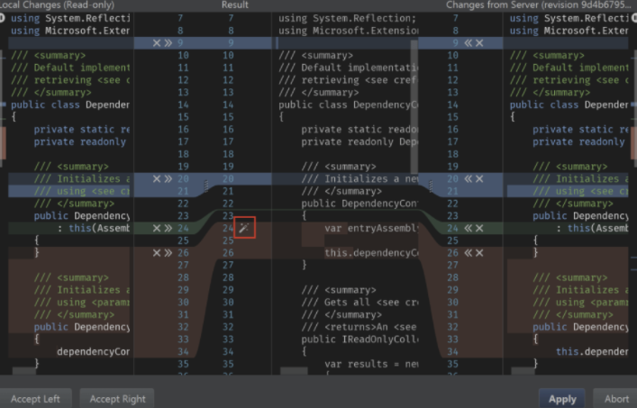

Git 상황별 명령어
========================
> git flow를 준수한 환경을 기준으로 설명을 하니 git flow를 한번은 봐두는 걸 추천

## glgg : zsh에서 디폴트로 제공하는 git alias 이다. 그래프 형식으로 커밋로그를 확인할 수 있다.


이렇게 CLI로도 브랜치의 흐름을 살펴볼 수 있다.
인텔리제이에서는 좀 더 멋지게 보여주고 있다.



## Unstaged file이 있는 상황에서 rebase(혹은 merge, checkout 등등)를 하려고 할 때
```
You hava unstaged changes.
Please commit or stash them 
```
이라고 나온다. 깃에서는 최소 단위가 커밋이다.
뭔가 merge를 하거나 checkout을 하려면 변경사항 없이 완전한 커밋으로 존재해야한다.

따라서 현재 변경사항을 임시로 어딘가에 저장해두고 마치 변경한 적 없게 하던가(stash),
변경사항을 포함하여 커밋을 해버리던가 하라는 소리다.

## rebase
rebase는 직관적 그대로 베이스를 새롭게 한다는 뜻이다.
#### 즉, 현재 브랜치가 뻗어나온 커밋 베이스를 변경하겠다라는 뜻이다.

주로 rebase는 feature브랜치에서 이루어지는데, 기능구현을 끝내면 테스트를 해야하고 테스트가 끝나면 develop 브랜치로 merge 해야한다.
develop에는 다른 사람들의 작업이 포함되어 있을 수도 있는데, 내가 개발하는 동안 다른 사람들의 feature브랜치가 merge된 상태에서 내가 merge를 시도하면 충돌날 가능성이 있다.

이렇게 되면 develop브랜치에서 충돌을 해결해야하고, 충돌 해결하고 나서 다시 테스트를 돌려봐야한다. 왜냐하면 merge가 잘 된지 확인해봐야 하니까...
#### 그런데 테스트를 해보니 에러가 난다면? 내 코드의 에러인지, 다른 사람의 에러인지, 아니면 충돌을 해결하다가 내가 실수를 한건지.. 도통 알 수가 없다.

#### 따라서 feature브랜치에서 develop 브랜치로 rebase를 하여서 feature브랜치 내에서 충돌을 해결하고 다시 테스트를 해보는 것이 안전하다.


이렇게 충돌이 발생하면 해결해주면 되는데
나는 intellij에서 reslove conflict기능을 제공해서 ui로 편하게 해결한다.

> 출처: 구글 사진 검색

이렇게 해서 완료하면  과거 develop의 어느 커밋으로 부터 나왔던 내 브랜치가, 
develop의 최신 커밋으로부터 브랜치가 나온 것으로 변경된다.

#### rebase를 하기 전에는 베이스가 될 브랜치에서 반드시 git pull땡겨라 제발!!!!!

## squash
다음에 계속 작성할 예정..


