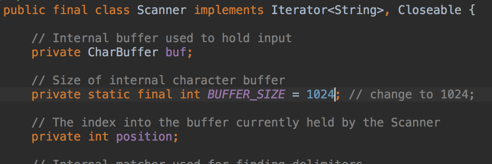
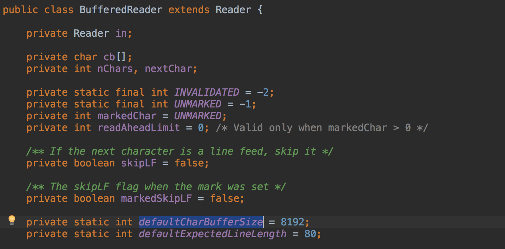
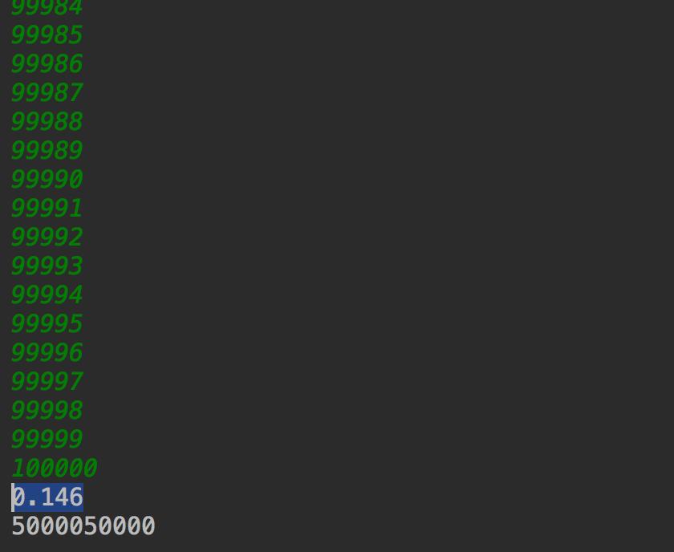
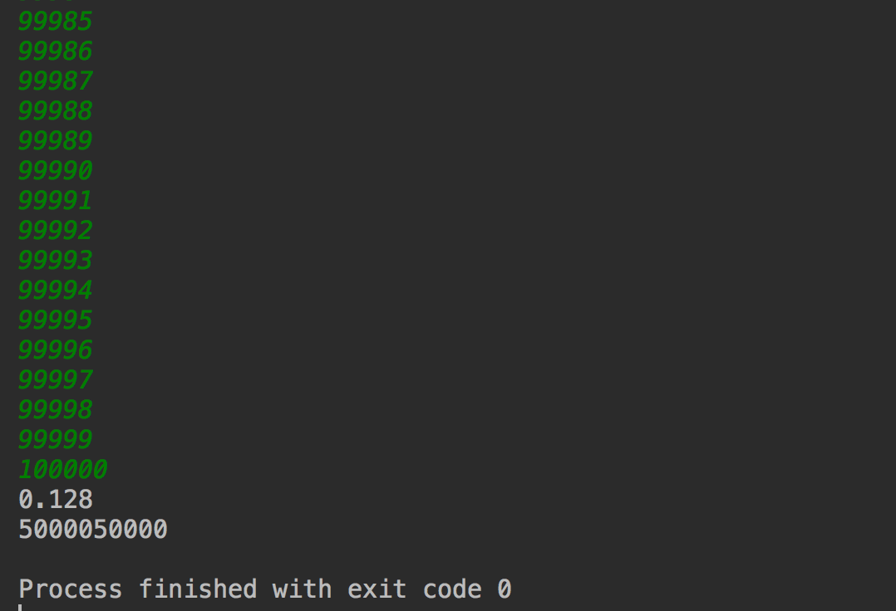
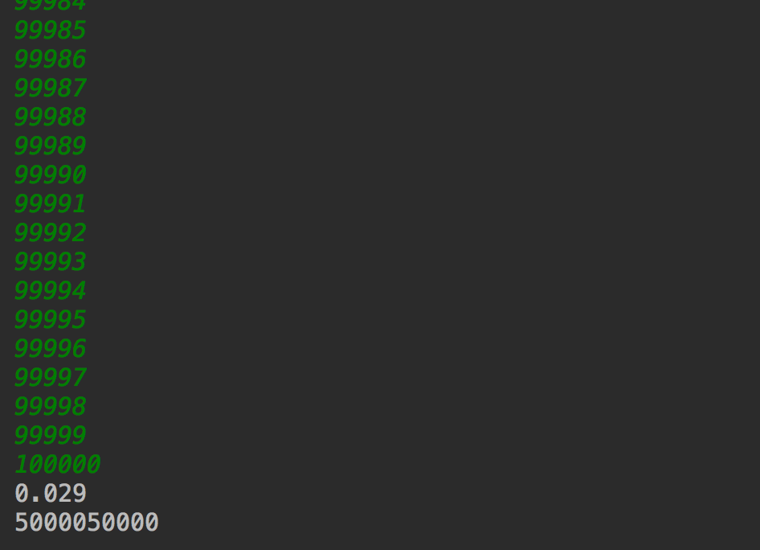
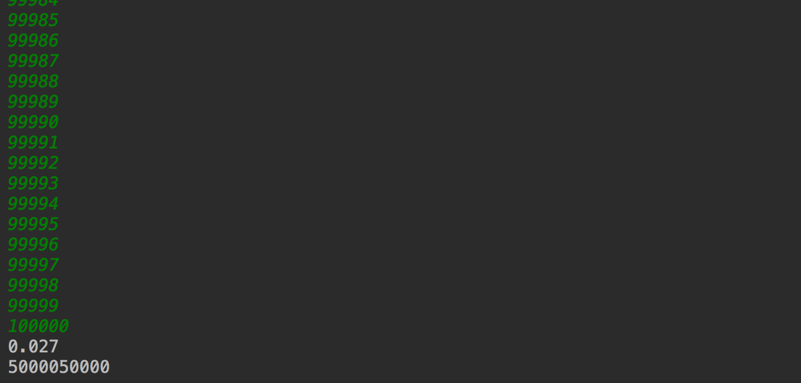

Scanner와 BufferedReader
=============================

## Scanner
보통 자바 콘솔 입력을 받아야할 때 Scanner를 사용해 왔다.
<pre>
Scanner in = new Scanner(System.in);
int num = in.nextInt();
String str = in.nextLine();
</pre>

입력의 양이 많지 않다면 편하게 사용할 수 있지만, 입력의 양이 많다면 다른 방법을 고려해봐야한다.
실제로 시간이 중요한 알고리즘에서는 Scanner 사용을 피하는 게 좋다.

## BufferedReader
<pre>
BufferedReader reader = new BufferedReader(new InputStreamReader(System.in));
int num = Integer.parseInt(reader.readLine());
String t = reader.readLine();
</pre>
이런식으로 사용할 수 있다.


## 차이점
Scanner의 버퍼 크기는 1024바이트로 지정되어 있다.


InputStreamReader는 한 글자(char) 씩 읽어들이는데, Decorator 패턴으로 버퍼를 준 것이BufferedReader이다.
데이터를 매번 읽어오지 않고, 버퍼에 보관해두고 필요할 때 마다 읽어올 수 있다. 버퍼 크기도 8000대로 Scanner보다 크다.

결과적으로 Scanner 에 비해 8배 가량의 성능차이를 보일 수 있다. (버퍼 크기로 볼때)

BOJ 9999 문제를 풀면서 Scanner가 얼마나 느린지 알 수 있었다.

## 성능 측정
직접 성능 테스트를 해보자.
상황 : 10만개의 정수를 입력받아야함

#### Scanner
```
    public static void test1() {
        Scanner in = new Scanner(System.in);
        n = in.nextInt();
        long start = System.currentTimeMillis();
        for(int i=0; i<n; ++i) {
            result += in.nextInt();
        }
        long end = System.currentTimeMillis();
        System.out.println((end-start)/(double)1000);
        System.out.println(result);
    }
```


> Scanner 1차측정


> Scanner 2차측정



#### BufferedReader
<pre>
    public static void test2() throws Exception{
        BufferedReader reader = new BufferedReader(new InputStreamReader(System.in));
        n = Integer.parseInt(reader.readLine());
        long start = System.currentTimeMillis();
        while (n-- > 0) {
            result += Long.parseLong(reader.readLine());
        }
        long end = System.currentTimeMillis();
        System.out.println((end-start)/(double)1000);
        System.out.println(result);
    }
</pre>

> BufferedReader 1차측정


> BufferedReader 2차측정


테스트 결과 BufferedReader가 Scanner 보다 약 5배 가량 빠른 것을 확인할 수 있었다.
입력 개수가 늘어날 수록 차이는 커질 것이고, 백만 이상의 입력이 존재하는데, 1초 안에 풀어야한다면 Scanner를 사용하면 1초를 입력받는데 모두 써버릴 것이다.

### 한 줄에 여러개의 입력이 존재하면 StringTokenizer를 사용하자
<pre>
AB CDE FG HH IJ KLM .....(생략) 
ABC DE FGHI JK ...(생략)
AB CDEF GHI JKL ... (생략)
</pre>
이렇게 여러줄에 걸쳐서 입력이 들어오고 한 줄에 여러 문자열이 포함되어 있는 경우 (여러 정수가 포함되어 있을 수도 있다)

<pre>
reader.readLine.split(" ");
</pre>
이렇게 사용해도 좋지만 별도의 배열을 만들어 관리해야한다.

대신 StringTokenizer를 사용하면 보다 편리하다.

<pre>
    public static void test4() throws Exception{
        BufferedReader reader = new BufferedReader(new InputStreamReader(System.in));
        StringTokenizer st = new StringTokenizer(reader.readLine());
        while (st.hasMoreTokens()) {
            System.out.println(st.nextToken());
        }
    }
</pre>
 이렇게 사용할 수 있다. (예제는 한줄만 입력받는 것으로 작성했다.)
