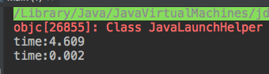

StringBuilder
============================

java는 문자열에 대한 지원을 아주 잘 하고 있다.
타입이 다른 자료형도 + 연산자를 사용하여 편하게 문자열에 연결할 수 있다.

하지만 편리함의 뒤에 어두운 면이 있다.
바로 성 ㅋ 능 ㅋ

몇 개정도의 객체를 문자열로 변환하거나, 한 줄 정도의 문자열을 다루는 것은 크게 나쁠 것이 없다. 
하지만 n개의 문자열에 연결 연산자를 반복 적용해서 연결하는 데 드는 시간은  n^2에 비례한다.

## 성능 측정
50000개의 정수를 반복해서 이어붙이는 작업을 String객체, StringBuilder객체를 사용했을 때 어떻게 시간이 걸리는지 측정해보자.
<pre>
public class Main {
    static final int MAX = 50000;
    public static void main(String[] args) {
        test1();
        test2();
    }

    public static void test1() {
        String temp = "";
        long start = System.currentTimeMillis();
        for(int i=0; i<MAX; ++i)
            temp  = temp + i;
        long end = System.currentTimeMillis();
        System.out.println("time:"+(end-start)/(double)1000);
    }

    public static void test2() {
        StringBuilder temp = new StringBuilder(1000);
        long start = System.currentTimeMillis();
        for(int i=0; i<MAX; ++i)
            temp.append(i);
        long end = System.currentTimeMillis();
        System.out.println("time:"+(end-start)/(double)1000);
    }
}
</pre>

성능 차이는 충격적이었다.

String을 사용했을 때에 비해, StringBuilder는 약 2000배 빨랐다.
일반적으로 문자열 연결 대상이 적을 때에도 StringBuilder가 적게는 수배, 보통 수십배 이상 빠른 성능을 보인다.

어떻게 이렇게 빠른 성능을 내는 것일까?
String은 불변객체로, 문자열 연결시 마다 새로운 객체를 생성해서 할당해야 한다.
따라서 이때 마다 새로운 공간을 할당해야하고 연결된 문자열을 복사해야하므로 시간적, 공간적으로 비효율 적이다.

반면에 StringBuilder는 AbstractStringBuilder를 상속하고 있는데, 이 AbstractStringBuilder는 내부적으로 char[ ]로 문자열을 관리한다.
AbstractStringBuilder는 생성자 호출 시,  이 배열의 크기를 지정받아서 초기화한다.
문자열 연결 시 마다 이 배열의 뒤에 이어붙이고, 길이 초과시, 기본 길이*2 +2 로 재할당 하여 복사한다.

성능이 우려되는 시점에서는 String보다 StringBuilder를 사용하는 것을 추천한다.
(특히 toString에서는 StringBuilder사용해라. Intellij에서 toString 자동으로 만들어주는 데, 어떤 방식 사용할지 선택가능하고 StringBuilder사용하도록 선택하면 된다.)
