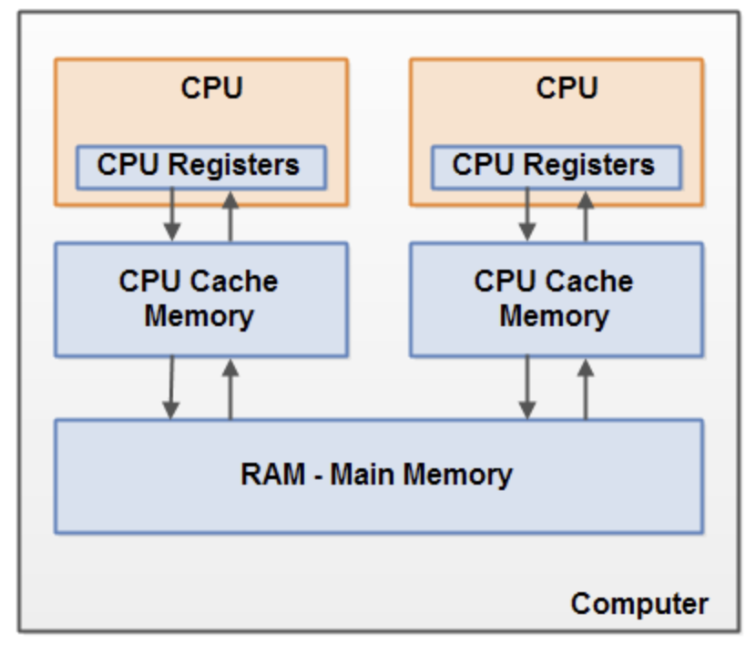

병행성
===================================
스레드를 사용하면 여러 작업을 동시에, 병렬적으로 진행할 수 있다.
요즘 컴퓨터들은 멀티코어가 기본이라, 동시에 여러 작업을 수행하기 위해서 병렬 프로그래밍이 기본이다. 

병렬 프로그래밍은 동시성이 주는 특징 때문에 고려해야할 사항이 많다. 고로 어렵다.
여러 쓰레드가 동시에 접근해야하는 부분을 고려해야하고, 최적의 성능을 낼 수 있도록 고민해야한다. 병렬 프로그래밍 공부는 진짜 맛보기로 해봤는데 엄청 어려운 것 같다...

하지만 꾸준히 볼 필요가 있는 개념이고, 개발자라면 반드시 정복해야할 것 같은 직감이 들어서 이 기회를 빌어 기본을 잡아두자.

글 내용은 이펙티브 자바를 기반으로 한다.


## 동기화
대부분의 개발자들은 동기화 == 상호배제성이라고 생각한다. 이는 틀린 말이 아니지만 동기화는 상호배제성과 더불어, 다른 쓰레드가 변경한 사항을 관측할 수 있어야한다.
이는 매우 중요한 사실인데 예제를 통해 살펴보자

```
public static void test5() throws Exception{
    Thread thread = new Thread(new Runnable() {
        @Override
        public void run() {
            int i=0;
            while(!flag)
                i++;
        }
    });
    thread.start();
    TimeUnit.SECONDS.sleep(1);
    flag = true;
}
```
어떻게 동작할까? 메인 쓰레드가 1초 슬립 후에 플래그를 세우니, 백그라운드 쓰레드는 이를 쓰레드 시작 1초후에 발견하고 종료할 것이다. 따라서 1초 후에 이 프로그램은 끝이나야한다.

하지만 이 프로그램은 끝나지 않는다.

원인은 메모리 구조에 있다. 하나의 코어는 하나의 쓰레드를 돌릴 수 있는데, 필요한 데이터를 메인 메모리에서 가져오는데 그 사이에 캐시 혹은 레지스터에 저장할 수 있다. 바로 최적화를 위해서다.



왜냐하면 접근 속도가 메인메모리 < 캐시 < 레지스터 이기 때문에 최적화가 되면 메인 메모리에서 읽어서 캐시 혹은 레지스터에 두고 계속 읽는다.

즉, 메인 쓰레드에서 플래그를 변경하더라도 백그라운드 쓰레드는 확인할 수 없다.

만약 상호 배제성이 되더라도 변경사항을 관측할 수 없다면 쓰레드간 안전성을 확보할 수 없다.

### 정리하자면 동기화는 쓰레드가 일관성이 깨진 객체를 관측할 수 없도록 할 뿐 아니라, 동기화 메서드나 동기화 블록에 진입한 쓰레드가 동일한 락의 보호 아래 이루어진 모든 변경의 영향을 관측 할 수 있도록 보장한다.

따라서 병렬 프로그래밍에서는 이러한 변경 가능한 공유 데이터에 대한 접근을 동기화해야한다.

동기화 락을 아래와 같이 걸 수 있다.

```
public class Main {
    private static boolean flag = false;
    public static void main(String[] args) throws Exception{
        Thread thread = new Thread(new Runnable() {
            @Override
            public void run() {
                int i=0;
                while(!getFlag())
                    i++;
            }
        });
        thread.start();
        TimeUnit.SECONDS.sleep(1);
        setFlag(true);
    }

    public static synchronized boolean getFlag() {
        return flag;
    }

    public static synchronized void setFlag(boolean f) {
        flag = f;
    }
}
```

상호배제 (mutual exclusive)를 하게 되면 락 획득을 위한 대기가 발생할 수 있다. 병렬 프로그래밍의 핵심은 이러한 대기 시간을 최적화하여 전체적인 프로그래밍의 속도를 빠르게 하는 것이다. 위와 같은 간단한 예제에서는 상호배제를 포기해도 된다. 대신 변경 사항 관측은 확보를 해야 안전한 쓰레드간 통신이 가능하다. 

이러한 상황에서는 락 대신 volatile 키워드를 사용할 수 있다. volatile 키워드는 데이터 참조와 쓰기를 반드시 메인메모리에 적용한다는 보장이 있다. 따라서 상호배제를 포기하더라도 아래 소스는 1초 후에 종료 할 수 있다.

```
public class Main {
    private static volatile boolean flag = false;
    public static void main(String[] args) throws Exception{
        Thread thread = new Thread(new Runnable() {
            @Override
            public void run() {
                int i=0;
                while(!flag)
                    i++;
            }
        });
        thread.start();
        TimeUnit.SECONDS.sleep(1);
        flag = true;
    }
}
```
하지만 상호배제성을 확보해야한다면 반드시 동기화를 해야한다.

## 과도한 동기화를 피하자
동기화를 크게 잡을 수록 생각하기 편하지만 성능을 포기해야 할 수도 있다.
득정 메소드에서 공유 데이터를 접근하는 소스가 한줄이라면 해당 줄만 동기화를 걸면 되지만, 메소드 전체에 락을 걸어버린다면 공유 데이터 변경 뿐만 아니라 동기화가 필요없는 그 밖의 로직을 수행하면서도 다른 쓰레드들이 기다려야한다. 이러한 경우 동기화 블럭을 작게 잡을 필요가 있다.

 하지만 과유불급이란 말이 있듯이, 동기화도 과하게 잡게 되면 역효과가 날 수도 있다. 너무 많은 동기화는 성능저하, 데드락, 비결정적 동작등을 유발할 수 있다.

  자주 하는 실수는 동기화된 메소드에서 비동기된 메소드를 호출하는 것이다. 이는 가능하면 피하는게 좋은데, 비동기된 메소드에서 쓰레드를 만들어 같은 락을 기다리게 된다면 데드락이 걸릴 수 있다.
