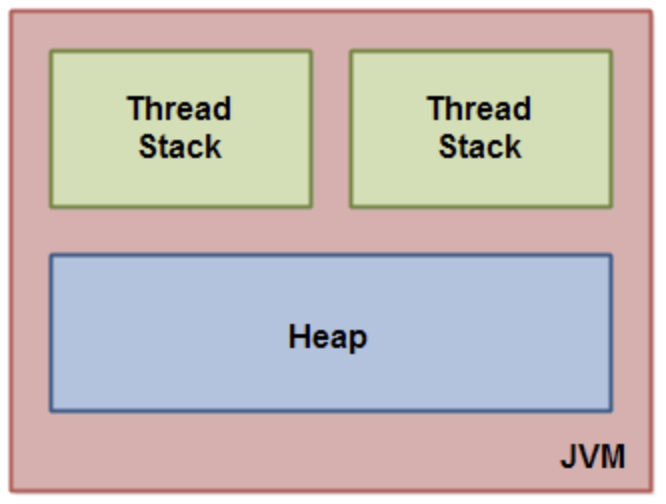
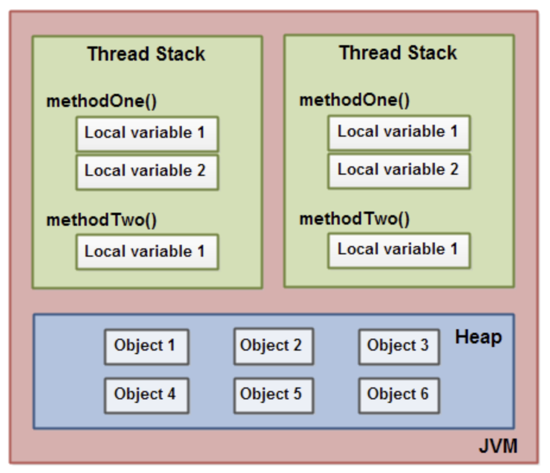

Thread
============================
참고 사이트
<pre>
1. http://parkcheolu.tistory.com/14
	- 원본 : http://tutorials.jenkov.com/java-concurrency/java-memory-model.html
2.  
</pre>

쓰레드를 사용하면 동시에 여러 작업을 수행할 수 있다.

얼핏보면 프로세스와 비슷한데, 중요한 차이점이 있다.
```
프로세스는 컴퓨터에서 실행되고 있는 완전한 하나의 프로그램이다. 
또한 프로세스간 별도의 메모리 공간을 사용하여 서로 침범하지 않는다. 

이에 비해 쓰레드는 프로세스 내에서 실행되고, 쓰레드 간 자원은 공유된다.

하나의 프로세스는 하나 이상의 쓰레드가 구동되고 있다.
단 하나의 쓰레드만 존재할 때, 이를 메인 쓰레드라고 한다.
```
 

## 자바의 Thread 

#### 기본적인 Thread 생성 : 자바의 쓰레드 생성 방식은 크게 두 가지로 나뉜다.

```
1. Thread 클래스를 상속받는 방법
2. Runnable 인터페이스를 구현하는 방법
```
Thread는 재사용이 불가능하므로, 한번 사용하고 나면 버려져야한다. 같은 행위를 또 하고 싶으면 새로운 쓰레드 객체를 만들어 내야한다.


## Process와 Thread

Process는 실행중인 프로그램으로, 일을 수행하기 위해서는 데이터, 자원(메모리, cpu time), 쓰레드를 필요로한다.
즉, 쓰레드는 프로세스의 구성요소 중 하나로, 프로세스의 실제 작업은 쓰레드에 의해 진행된다.
Process의 메모리 구조는 크게  Code, Data, Heap, Stack 영역으로 나뉘고, 쓰레드들은 같은 프로세스에서 실행되기 때문에 이 메모리 구조를 *공유*한다.

stack 영역은 호출하는 메소드의 정보를 기록하는데, 쓰레드는 독립적인 수행을 위해서 자신만의 호출 스택을 필요로 한다.
즉, 쓰레드 생성마다 각 쓰레드에게는 개별적인 Stack영역이 할당된다.  



<pre>
Each thread running in the Java virtual machine has its own thread stack. 
The thread stack contains information about what methods the thread has called to reach the current point of execution. 
I will refer to this as the "call stack". 
As the thread executes its code, the call stack changes.
</pre>

#### Thread 클래스를 상속받기
Thread클래스를 상속하면 run 메소드를 오버라이드 하여야하고, Thread객체의 start메소드를 호출해서 쓰레드를 실행시킨다.
> run을 호출하는 것은 쓰레드를 실행하는 것이 아니라, 단순히 run 메소드를 호출하는 것이다. 반면에, start는 새로운 쓰레드가 작업을 실행하는데 필요한 호출 스택을 생성한 다음에 쓰레드 스케줄러에 의해 실행된다.
```
	Thread myThread = new Thread(){
            @Override
            public void run() {
                for(int i=0; i<10; ++i)
                    System.out.println("hello");
            }
        };
        myThread.start();
```

#### Runnable 인터페이스 구현
```
	Runnable myRunnable = new Runnable() {
            @Override
            public void run() {
                for(int i=0; i<1000; ++i)
                    System.out.println("hello world");
            }
        };
        myRunnable.run();
```

##### 여담으로, 안드로이드에서는 AsyncTask라는 추상클래스를 제공한다. 안드로이드 정책상, 메인 쓰레드에서만 뷰 갱신이 가능하지만, AsyncTask를 통해 쓰레드를 사용하면서도 뷰 갱신이 가능하다. (결국 까보면 메인쓰레드에서 갱신하는거지만 추상화하여 사용자는 느낄 수 없다.)

## Runnable, Thread의 차이

이 둘의 차이는 클래스와 인터페이스의 차이라고 보면 된다.
자바는 다중상속을 지원하지 않기에, 쓰레드를 상속하면서 다른 클래스를 상속할 수 없다는 한계가 존재한다. 이 때 유용한 것이 Runnable이다. 인터페이스를 사옹하면 상속보다 유연하게 구현가능하다. 


## 쓰레드 상태 제어

1. Thread 휴식
Thread.sleep 을 하게 되면 쓰레드는 휴식을 취하면서, cpu time을 다른 쓰레드가 가져갈 수 있다.
다만, Thread.sleep(0)은 하면 안된다. 바로 return하기 때문에 의미 없다.

2. Thread 종료 기다리기
```
Thread myThread = new Thread(){
    @Override
    public void run() {
        for(int i=0; i<1000; ++i)
            System.out.println("hello");
    }
};
myThread.start();
myThread.join();
//myThread 종료가 돼야 비로소 test3 method가 출력된다.
System.out.println("test3 method!!!");
```

3. wait와 notify
Thread의 wait을 통해서 특정 쓰레드 종료를 기다릴 수 있다. 
notify는 쓰레드 내부에서 자신을 기다리는 쓰레드들을 깨워준다.
이 둘은 동시에 실행되면 위험할 수 있다. 따라서 반드시 동기화 처리가 되어야한다.
다시 말하자면, wait, notify, notifyAll 메소드는 반드시 wait할 대상 쓰레드, 혹은 깨우기를 하려는 주체 쓰레드의 (전자와 후자는 같다) 고유락을 가지고 있어야한다.

반드시 동기화가 필요한 이유는, 워낙 빠르게 동작한 나머지, 깨우는 행위와 기다리는(잠드는) 행위가 동시에 일어나서 한 쪽은 락이 걸릴 수 있다.
사실 고유 락을 가지지 않고 wait 을 호출하면 IllegalMonitorStateException이 발생할 수 있다.

락을 가지고 wait메소드를 호출하면 락을 해제하고 잠이든다. 그리고 누군가가 깨워줄 때 까지 wait은 리턴되지 않는다.
```
Thread thread = new Thread(){
    @Override
    public void run() {
        synchronized (this) {
            for(int i=0; i<10; ++i) {
                System.out.println(i+"번째 실행...");
                try {
                    Thread.sleep(0, 100);
                } catch (InterruptedException e) {
                    e.printStackTrace();
                }
            }
        }
        notify();
    }
};
thread.start();
synchronized (thread) {
    System.out.println("thread가 종료될 때 까지 기다리기");
    thread.wait();
}

System.out.println("the end!");
```

## Executor
자바의 일반 쓰레드 구동방식은 다양하지만, Executor는 단지 하나의 방식으로 간단하게 쓰레드를 구동할 수 있다.
사용 방법은 아래와 같다.
> 태스크를 정의한 클래스 생성
> Executor Service에 태스크 객체 제공

Executor는 실행자 프레임워크라고 불리우며, 우리가 작성한 프레임워크의 제어권을 가져간다.
검증된 방식으로 짜여졌기 때문에, 수준 높은 성능을 낼 수 있으며 코드도 간단하다.


## 자바 메모리 모델과 쓰레드
우선 출처에서 밝힌 블로그에서 java memory 모델에 대해서 읽어보고 오자
> http://parkcheolu.tistory.com/14 (번역본)
> http://tutorials.jenkov.com/java-concurrency/java-memory-model.html (원본)



jvm은 그 자체로 온전한 컴퓨팅 모델이고, 따라서 메모리 모델을 가지고 있다. 이것이 '자바 메모리 모델' 이라고 불린다.
자바 메모리 모델을 잘 이해해야 동시성 제어를 제대로 할 수 있다.


