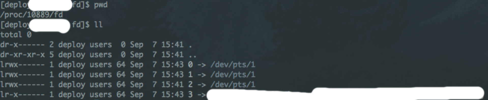

redirection
==========================
참고 : https://jdm.kr/blog/74

리눅스의 프로세스는 3개의 기본 스트림을 가진다.<br>
pid를 알면 해당 프로세스가 사용하는 스트림을 확인할 수 있다.
```
/proc/{pid}/fd
```



파일디스크립터 0, 1, 2에 각각 표준 입력, 표준 출력, 표준출력, 표준에러출력이 할당되어 있다.<br>
리눅스에서 명령어를 치고 화면에 보이는 원리는, 명령어로 실행된 프로세스가 결과물을 출력스트림으로 내보내주는 것이다.<br>
리다이렉션은 이러한 디폴트 스트림을 다른 스트림으로 바꿔주는 것이다.


***

> 에시1
```
ls -al > redirection_ls_test.txt
```
ls -al의 출력을 redirection_ls_test.txt라는 파일로 돌린다. <br>
파일이 없으면 만들어지고, 내용물은 ls -al의 결과물이 들어간다.


 > 예시2
```
head < redirection_ls_test.txt > redirection_head_test.txt
```
head는 입력으로 받은 내용을 10줄 출력해주는 명령어다(디폴트가 10줄)

실행 순서는
head < redirection_ls_test.txt <br>
그리고 이 head의 출력물 > redirection_head_test.txt 가 실행된다.

최종적으로 redirection_head_test.txt에는  redirection_ls_test.txt의 상위 10줄이 기록된다.
