TCP/IP
====================

## Intro
tcp/ip를 처음 접했을 때는 대학교 2학년 때였다. 
로컬 개발의 한계를 느낄 때 즈음 네트워크를 통해 다른 컴퓨터의 프로그램과 통신하는 방법은 상당히 매력적으로 다가왔다.

 하지만 패킷, 라우터, 논리주소와 물리주소, ocp 계층 등은 너무나 혼란스러웠다. 단기간에 많은 내용을 이해하기 어려웠고 결국 시험이 끝남과 동시에 많은 지식을 잊어버렸다. 그러면서 합리화가 찾아왔다. 사실 사용하는 법만 알면 되는거 아닌가? 라는 의문이 들었다.

 현업을 와서 느낀 것이 있다면
1. 내가 사용할 줄 안다고 해서 그것을 잘 아는 것은 아니다.
2. TCP의 아주 로우한 부분까지 이해하면 아주 도움이 되는 것이 많다.
3. 서버 개발자라면 2를 만족하는 것이 좋다.

그래서 다시 기억을 더듬으면서 다시 tcp 개념을 다잡을 것이다.

### 참고 사이트 : http://www.tcpipguide.com/index.htm
### 참고 사이트 : https://d2.naver.com/helloworld/47667

## tcp overview

- Connection-oriented : Provides establishment, maintenance and termination of a logical connection
- Reliable data transfer :
    - Provide absolutely perfect service to higher layer
    - Error control, Flow control, Congestion control
    - In-order byte stream : Each octet is numbered sequenttially
- Support only point to point
    - in the logical connection, there are only one sender and one receiver
    - Does not support multicast

# Tcp segment 
tcp의 헤더 기본 사이즈는 20 byte이고, option은 최대 40byte까지 가능하므로, 헤더의 최대 사이즈는. 60byte이다.
Tcp 헤더는 항상 4의 배수로 되는데 이를 맞추기 위해 Option에 EOP(End Of Option), NOP(No Operation Option)이 유일한 단일 바이트 옵션으로 존재한다. 이를 패딩처럼 활용해서 4byte를 억지로라도 맞춘다.

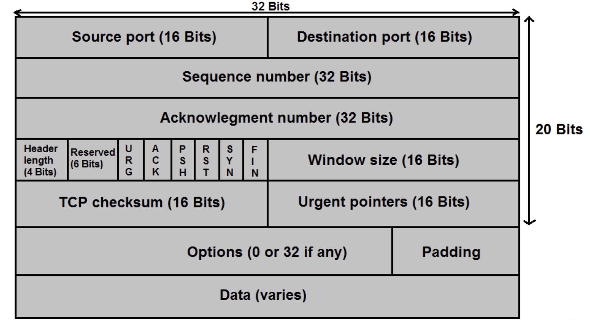

#### 주의 
<pre>
6개의 flag
U : URG(urgent data) 로 긴급 데이터를 담은 세그먼트를 표시할 때 사용한다. 실제로 거의 사용 안 된다.
A : ACK 이 세그먼트가 Acknowledgement 를 알리기 위한 목적인지 표시
P : PSH(Push Data now) 얼른 하위 레이어로 보내라는 플래그
R/S/F : RESET, SYN, FIN : Connection control (이 3개 중 하나라도 1이라면 TCP 세그먼트는 데이터를 실어나르지 못한다. RESET은 비정상 경우임

Rcvr window size : 송신자가 자신의 여유 버퍼사이즈를 기록하여 넘기는 것으로, 수신측은 이를 받아서 보내줄 데이터의 양을 결정할 수 있으므로, Flow control이 일어나게된다.
</pre>

### Sequence number
- byte단위로 기록되며, 11번째 바이트~20번째 바이트(총 10바이트)를 보내면 sequence number는 초기 값+11이다.
- 초기값은 랜덤하게 세팅된다.
    - 첫번째 이유 : 0부터 보내면 시퀀스 넘버 만으로 얼마나 많은 데이터가 오갔는지 유추가능하기에 보안적으로 허술
    - 두번째 이유 : 이전 연결에서 남아있던 세그먼트가 현재 연결에서 읽힐 수가 있음. 그래서 랜덤하게 시작하면 이를 회피가능.
- 32bit 라서 2의 32승의 모듈러 값이 유효한 값이다.

### Acknowledgement number
- Seq number of next byte expected from other side”
- Ack flag가 1이여야 한다.
- 송신자의 seq값 s와 ack값 a이 수신자가 받으면 다시 보낼때는 seq을 a로, ack를 s+1로 보낸다. 이게 반복

### Option
<pre>
- Single byte : EOP, NOP 
- Multi bytes :
    - Maximum segment size : 세그먼트의 최대 사이즈를 기록해두는 곳으로, 연결 설정 시 결정되고 연결 종료까지 변화 없음
    - Window scale factor
    - Timestamp
    - SACK-permitted
    - SACK
</pre>
Tcp 헤더는 항상 4의 배수로 되는데 이를 맞추기 위해 Option에 EOP(End Of Option), NOP(No Operation Option)이 유일한 단일 바이트 옵션으로 존재한다. 이를 패딩처럼 활용해서 4byte를 억지로라도 맞춘다.

### Timestamp option
Used to measure round trip time (from sending tcp segment to receiving ACK)
Based on Greenwich standard time
<사진>

<pre>
송신측에서 round trip 시간 측정을 위해 TS value를 세팅해서 보냄
받는 측에서는 이 값을 그대로 복사해서 TS Echo Replay에 둔다. 다시 원래 송신자가 받을때는 current time - TS Echo를 하면 원하는 값이 나온다.

그러면 왜 복사할까?
수신측에서 여러개의 패킷(세그먼트)을 받았고 이들 각각 Timestamp option이 추가되어 있으면??
한꺼번에 하나의 패킷에 Timestamp를 찍어서 보내도 된다.
그러면 어느 패킷의 time stamp인지를 기록하기 위해서 Time Echo를 쓴다.
그러면서 Ack은 여러 패킷을 받은 것을 고려해서 기입한다.
</pre>

# Connection
TCP  sender, receiver establish connection before exchanging data segments
- Triggers allocation of transport entity resources (ex. buffers)
- Negotiation of params (ex. Initial seq no, flow control info (receive window), MSS

Connection determined by source and destination sockets (IP address of host, port number)
포트 쌍에서는 오직 하나의 connection만 존재 할 수 있다.

### connection establishment
Connection open : active(client) / passive(server)

### Establishing Connection : 3-way handshaking
너무나 많이 들어봤을 거다. 이제는 완벽하게 익히자

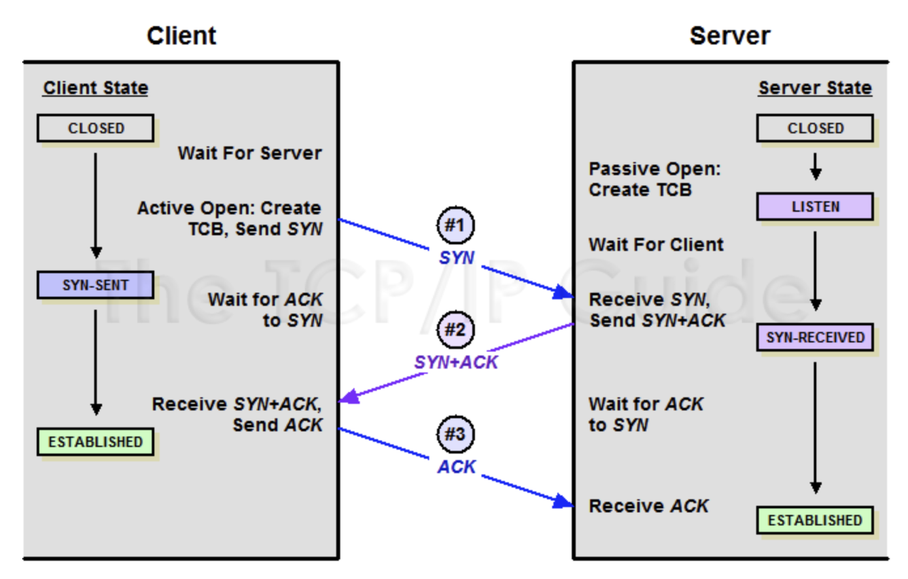

<pre>
그림 설명
</pre>

tcp에는 상태가 존재한다. 3-way 에서는 다음과 같은 상태변화가 있다.
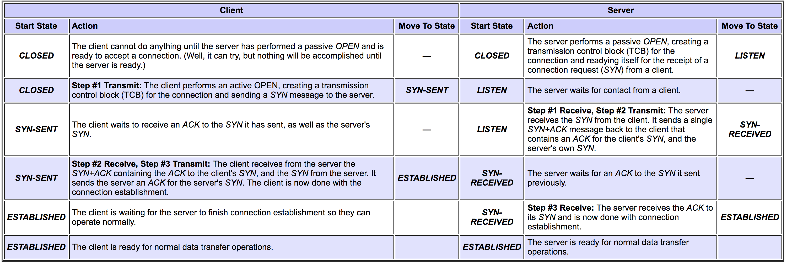

tcp상태에 대해서는 나중에 자세히 살펴보자.

### Closing Connection : 4-way handshaking (3-way로connection을 close 하는 경우도 있지만 정상적인 경우는 아니다)
There are active close and passive close
 
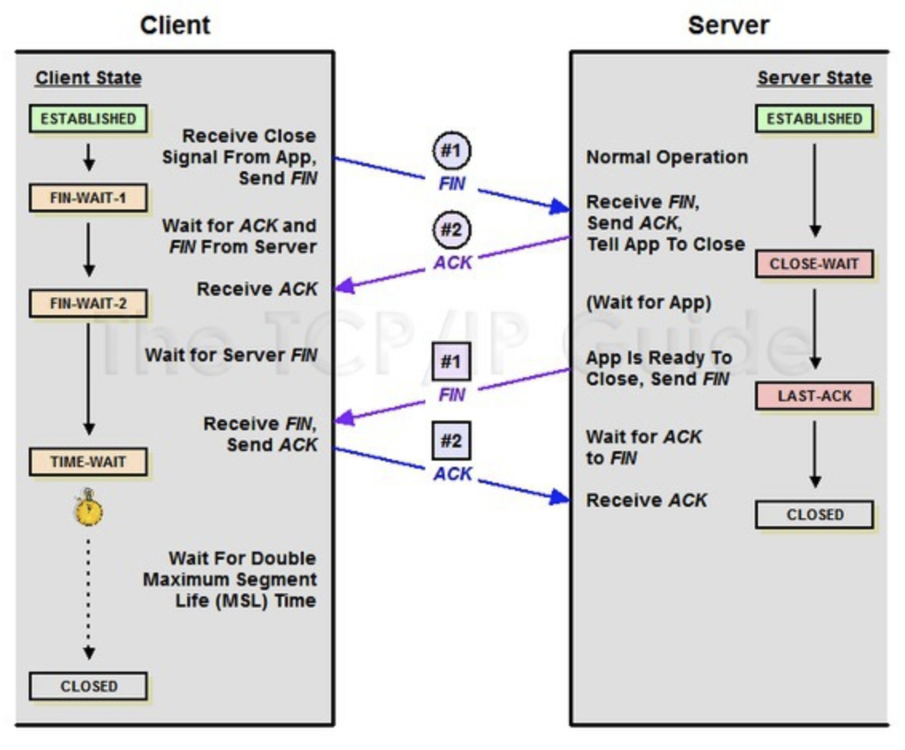

마찬가지로 4way handshaking 중에 tcp state가 어떻게 바뀌는지 살펴보자
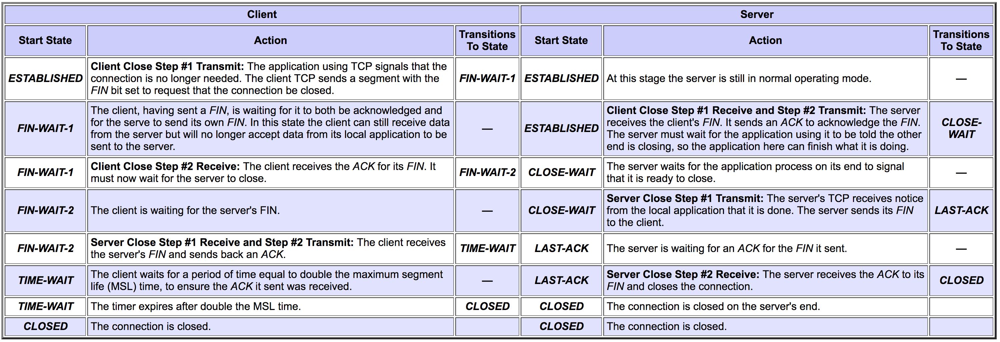
<4way tcp state사진>

> time-wait을 하는 이유 : 만약 마지막 패킷을 서버측이 받지 못하면 다시 보내달라고 패킷을 보내게 된다. 클라이언트가 이 여부를 확인하지 않고 마지막 ACK을 보내고 바로 끊어버리면 서버측은 무한정 대기할 수도 있다. 따라서 특정 시간을 기다렸는데 재요청이 안오면 서버가 마지막 패킷을 잘 받았다고 추측할 수 있는 상황이다. 그렇게 타임아웃이 발생하면 비로소 클라이언트도 연결을 완전히 끊는다.

### TCP State Summary
<state 요약 사진>
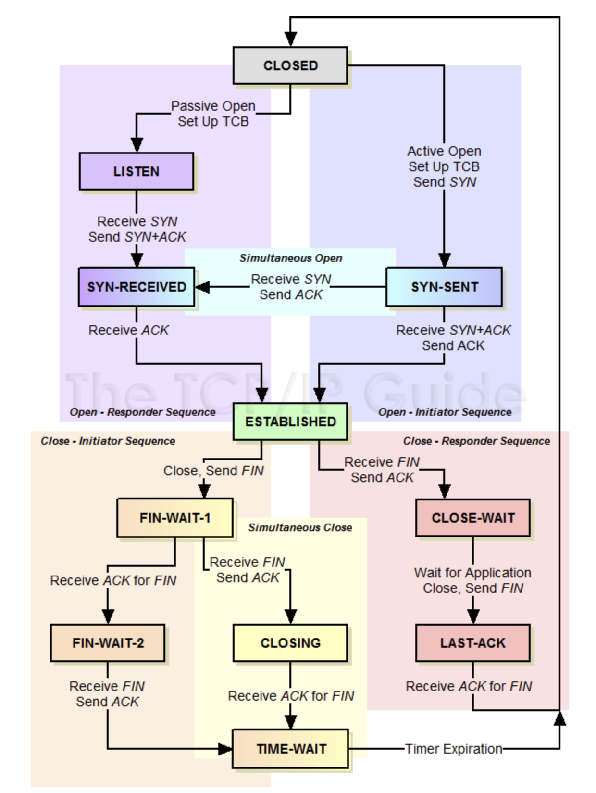

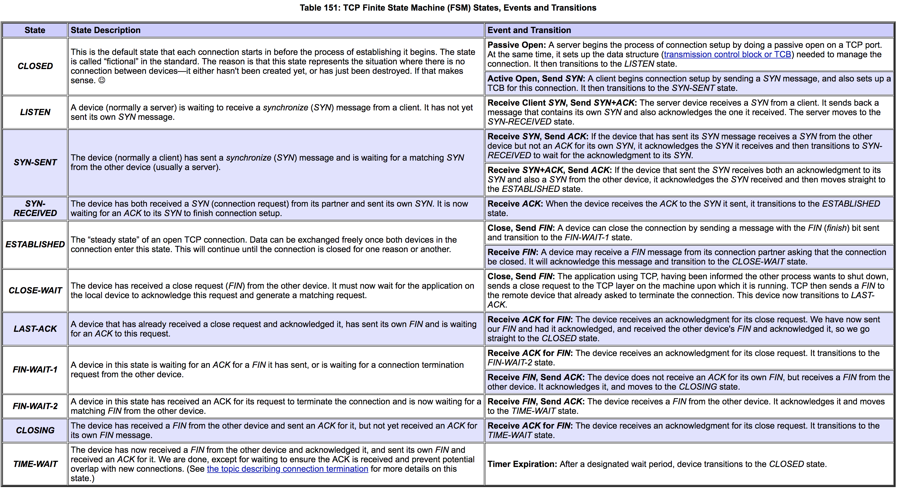
<pre>
state 사진 설명
</pre>

### TCP 6 ACK Rules

1) Piggybacked ACK on suitable outbound data segement

2) Send an explicit ACK 500ms after receiving data segment to suppress sending excessive ACK

3) Send an explicit ACK when two data segments are accumulated to avoid unneccessary retransmission

4) Send an explicit ACK when receiving out-of-order segment to inform the other side of segment loss

5) Send an explicit ACK when receiving the lost segment

6) Send an explicit ACK when receiving duplicate segment to cope with loss of ACK (cope with : 대응하다) 

<ACK rule 예시 사진 3개 정도?>

# TCP Skills
To provide reliable service, TCP has some uesful skills!

### Error Control

Error Detection : checksum which is in header of segment

Error Recovery : by retransmission

### Retransmission Rule
<pre>
1. when RTO is expired
2. when revceive 4 ACKs for same segment
</pre>

### Adaptive RTO scheme (Retransmission Time Out)
연결 상에서 데이터를 주고 받는 상황에 따라 유동적으로 RTO 시간이 변한다. 
RTO is dynamically updated based on RTT measurement (RTT : Round Trip Transmission)

> 간단하게 보면 RTT가 늘어날 수록 RTO의 시간제한도 넉넉하게 길어진다. RTT가 매우 짧으면 굳이 RTO가 길 필요 없다. 이 때는 RTO도 짧아진다.

RTO를 세팅하는 경우는 두 가지다.
<pre>
RTO가 만료되어 재전송이 이루어 질때 (Timeout probably due to network congestion)
 RTO = q * RTO (q는 보통 2)

RTT를 보면서 RTO를 조절
 RTO = RTTs + (4*RTTd)
 RTTs : smoothed RTT 
	RTTs = (1-a)RTTs + aRTTm (aRTTm : 순간측정)
	여기서 좌항의 RTTs 는 과거 history, RTTm은 지금 막 측정한 값이다. 이 둘의 비율로 RTTs 가 결정된다.
 RTTd : RTT deviation (RTT 편차) => 쉽게 마진이라고 생각하면 됨.
	RTTd = (1-b)RTTd + b | RTTs - RTTm |

</pre>

### Flow Control
Prevent overflow at receiving buffer of TCP : 상대측의 버퍼를 고려하여 데이터 전송량을 조절

<pre>
In a connection between a client and a server, the client tells the server the number of bytes it is willing to receive at one time from the server; this is the client's receive window, which becomes the server's send window. Likewise, the server tells the client how many bytes of data it is willing to take from the client at one time; this is the server's receive window and the client's send window.
</pre>

(넘치는 것은 곧 유실)
이를 위해 데이터를 전송할 때 자신의 수신버퍼 상황을 TCP header에 기재하여 보낸다. TCP 통신에 참여하는 컴퓨터는 상대방의 수신버퍼를 Sliding window로 표현하여 가지고 있는다. 그리고 데이터 전송 시, 이 Sliding Window를 참고하여 상대방 버퍼가 넘치지 않도록 송신 데이터양을 조절한다.

rwnd를 초기화 하는 시점은 3way handshaking으로 연결 설정을 할 때이다.

A컴퓨터에서 B컴퓨터로 TCP segment를 보낼 때 seq = i, ack = j, rwnd = k 이면 A는 아래의 의도로 보냈다.
>  B야 너가 보낸거 j-1까지 잘 받았고, j를 주셈. 나의 수신버퍼는 j부터 j+k-1까지 즉, k개 만큼 받을 여유가 있어

자 그럼 Window를 살펴보자

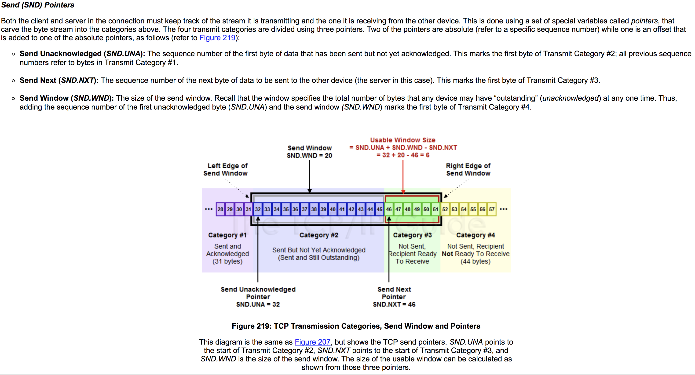

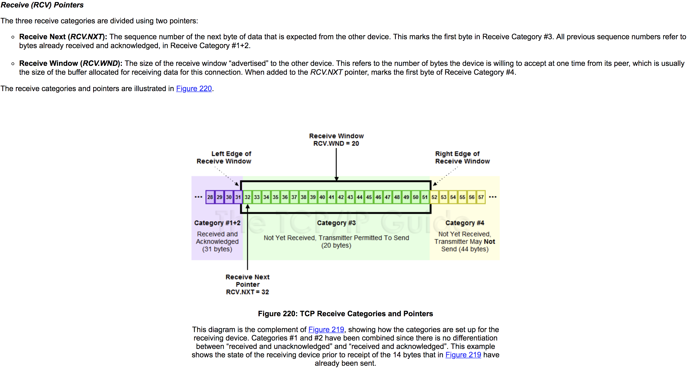

내 예상이지만, 그래서 더 공부해야겠지만
각 통신 노드는 send window만 가지고 있을듯... recv window는 곧 버퍼 상황이니까 안가지고 있어도 되지 않으려나?? 자신의 하드웨어인데.. 아니려나?? 커넥션 생성될 때 os로부터 할당받는 자원중에 recv winodw가 있고 이거를 데이터처럼 관리하는건가?? 아 아니다 둘다 가지고 있겠다

>recv window는 상대방의 버퍼상태를 가지고 있는거다.

아무튼 한쪽의 send window는 상대의 recv window의 상태와 비슷하게 간다.

send window size = minimum(rwnd, cwnd) 
여기서 cwnd는 무엇일까? 혼잡제어에서 답을 찾을 수 있다.

### Congestion Control
"Probing" for usable bandwidth
Ideally : Transmit as fast as possible if no congestion
 
네트워크가 혼잡하면 통신이 원활하지 않을 수 있다. TCP는 네트워크 상황을 고려해서 보내는 양을 조절한다.
  
cwnd : Congestion Window

이것은 혼잡제어를 고려해서 한번에 보낼 수 있는 최대의 데이터 양을 표시하고 있다.
TCP는 혼잡제어를 위해, 네트워크가 원활하면 cwnd를 늘리고, 네트워크가 혼잡하면 cwnd를 줄인다.

Tow phases : use a threshold value "ssthresh" (slow start threshold)
<pre>
1) slow start : when cwnd < sshtresh
2) congestion avoidance : when cwnd >= sshtreshold
</pre>

1) 의 경우에는 ack이 올때 마다 cwnd가 1씩 증가한다. (물론 여러개의 ACK 이 한번에 오면 여러개 만큼 증가) (사실 이건 전혀 느린게 아니다!!)
2) 의 경우에는 ack이 올때 마다 cwnd가 1씩 증가한다 (여러개의 Ack이 한번에 오면 slow start와는 다르게 1 증가한다) 

#### Decrease 하는 경우

When RTO expires
<pre>
 ssthreshold가 1/2 되고,
 cwnd는 1 * MSS가 된다.
 즉, slow start 상태가 된다.
</pre>

When the same 4ACK's are received 
<pre>
이건 RTO가 만료된거보다는 미약한 징후라서 대처도 크게 빡빡하진 않음

sshtreshold가 1/2 되고,
cwnd는 그 sshthreshold가 된다.
즉, Congestion avoidance 상태가 된다.
</pre>

# TCP timers

<pre>
- Retransmission :RTO
- Persistence : flow control 중 일어날 수 있는 데드락을 방지
- Keep alive :
- Time-waited :
</pre>

### Persistence Timer
Use to exit from a deadloack when data flow is stopped by "ACK(rwnd=0)"

#### Deadlock scenario
<pre>
1. A sends an ACK(rwnd=0)
2. B closes its senddd window and stops sending data
3. A send an ACK(rwnd>0) to resume data flow, but it is lost during delivery
4. Two TCPs are infinitely waiting for action from the other side

*의문 3 에서 보낸것이 유실되면 RTO에 의해 A가 다시 재전송 안하려나??

ㅇㅇ 찾아보니까 Note that, no retransmission timer is set for an ACK segment 라고하네.
</pre>

So, TCP create a persistence timer for each connection, and start the timer when ACK(rwnd=0) is received
If no ACK(rwnd>0) is received until timer expires, send a probe segment to request an ACK(rwnd>0) :즉, "아직 버퍼 안비었니? 비었으면 ACK(rwnd>0) 좀 보내줘"라는 목적임
Every time a probe segment is sent, timeout value is doubled
즉, 첫 시작은 RTO 값과 동일하게 시작하고, probe 보낼때마다 persistence timer는 2배가 된다. 그리고 maximum은 60초이다.

이렇게 계속 persistence timer가 올라가면서 probe segment를 보내도 답이 없으면 tcp는 연결을 파기함. 그리고 상대에게 알려줌

### Keepalive timer
Used to abort a connection when client tcp fails 
(클라이언트가 다운되면 서버는 알 수 없다. 커넥션을 물고 무한정 기다리게 될 수도 있다. 이를 방지하기 위한 타이머)

# TCP Structure
굉장히 단순화한 그림
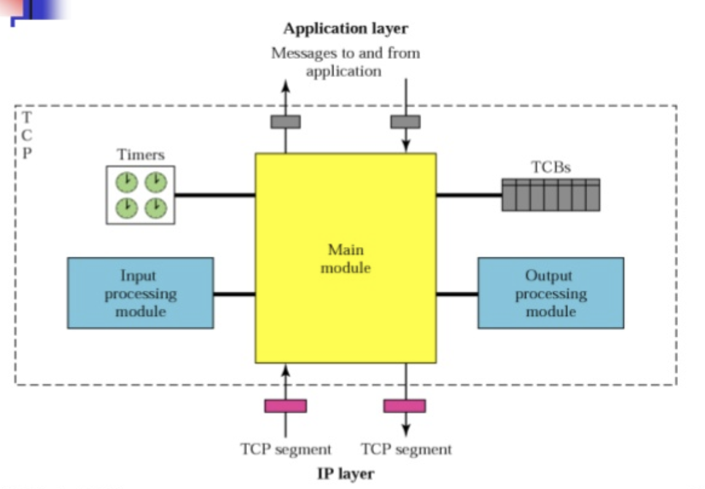

### TCB : Transmission control block
in TCB, stroes information of connection

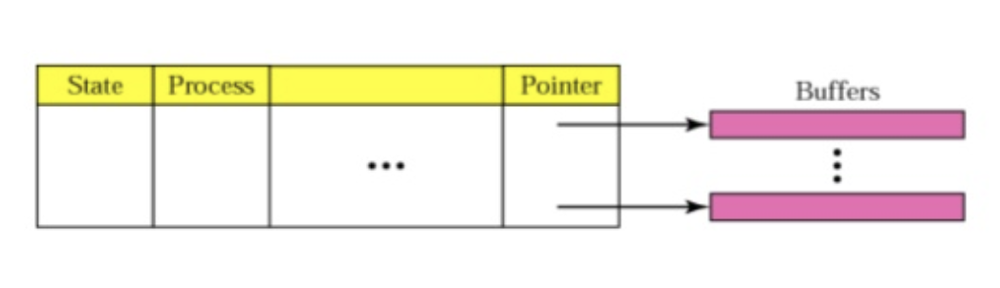

<pre>
한 튜플은 하나의 커넥션의 정보들을 담고 있다.
컬럼들은 다음과 같다.
- state : 튜플이 비어있는지, 채워져있는지
- process : 사용자(고객, application) 식별자
- Source/Destincation IP address and port number -> 소켓 식별자
- send/receive window
- Seq / ACK number
- RTT
- Timeout values of timers
- Buffer and pointer : 올라가는 데이터, 내려가는 데이터들을 담은 버퍼
</pre>

### Main module

<pre>
Receive : a TCP segment, a msg from an application, or a time-out event
1. TCB를 확인해서 해당하는 block이 있는지 확인한다.
2. 없으면 state를 CLOSED로 만든다.
3. TCB를 확인해 state에 따라 행동한다.(이때는 2번을 통해 무조건 TCB가 있을 수 밖에 없음) 
</pre>

여기까지가 TCP 기본 개념 설명 (추후 알게되는 사실이 있으면 계속 업데이트 할 예정)
이제 각종 상황에 대해 공부해볼거다

